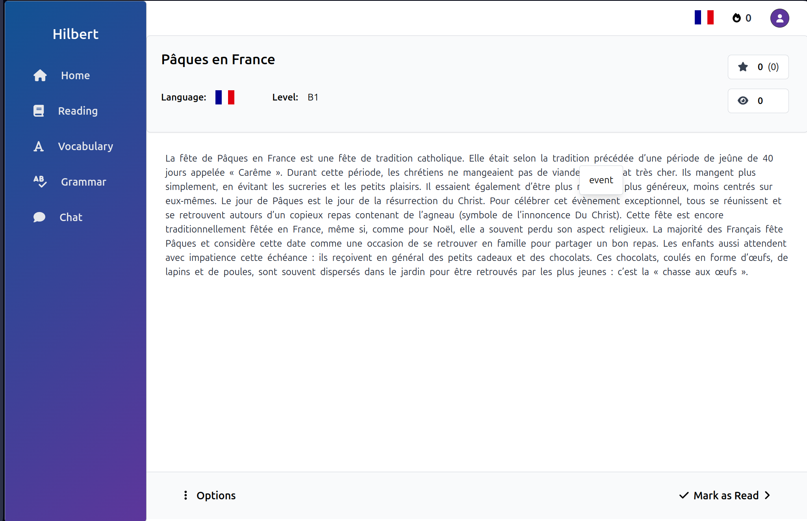

# Hilbert

## 🌟 Overview

Hilbert is a comprehensive language learning application aiming to provide a balanced learning experience among 4 key areas: vocabulary, grammar, reading and writing. The app is designed with a strong community-driven focus, allowing users to play a direct role in creating and enriching its learning resources.

## ✨ Key Features

* **Articles:** Pieces of text created by anyone, overlayed with translations and categorized by language, level, topic etc.
* **Vocabulary:** Hilbert keeps track of your learned words and can suggest articles or exercises to ensure spaced repetition.
* **Exercises:** To solidify grammar rules and refresh vocabulary. You can create your own exercises.
* **Chats:** You can chat with other Hilbert users or with a specialized chatbot.
* **Statistics:** Keeps track of your learning practices, XP etc.

## 🚀 Quick Start

Hilbert is not yet in production. You can use it locally by following these steps:
1. Ensure you have installed: Docker, Docker Compose, Java JDK 21, Maven, PostgreSQL.
2. Fetch the repository and open a terminal in the root.
3. Run a PostgreSQL server. In the `backend` directory, create an `.env` from the `.env.example`, changing the postgres password.
4. You need to build the Docker image of the main backend service, `hilbert-main`. To do this, run `cd backend/hilbert-main`, `mvn clean package -DskipTests`, `docker build -t hilbert-main .` If you also want to use the translation or chatbot functionality, build `hilbert-ml` as well (skipping the Maven step as it is a Python project).
5. From `root/backend`, run `docker-compose -f docker-compose.dev.yml up`. The services should be up and running now.
6. Lastly, run the web frontend: `cd web-frontend`, `ng serve`. You can now access the app at `localhost:4200`. Alternatively, run the mobile React Native frontend.

## Status

In mid stages of development.

## Contributing

All contributions are warmly welcomed. Head over to [CONTRIBUTING.md](https://github.com/TudorOrban/Hilbert/blob/main/CONTRIBUTING.md) for details.